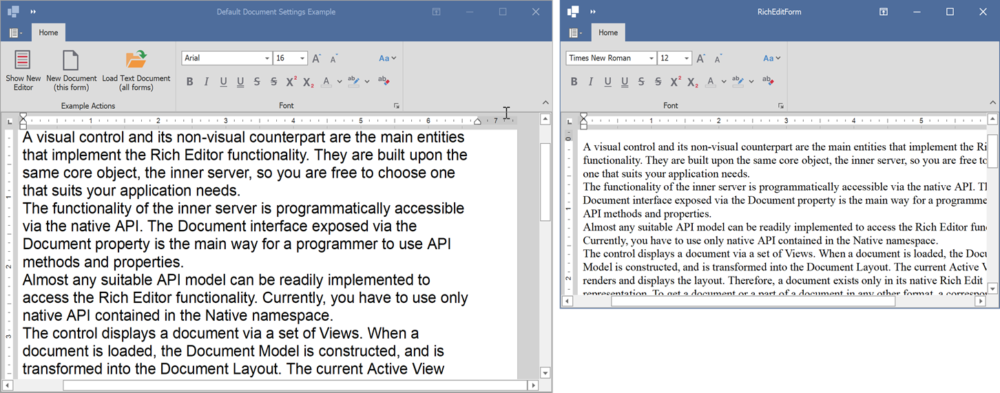

<!-- default badges list -->

<!-- default badges end -->

# How to Specify Default Document Formatting

This example illustrates two methods to specify default document formatting. The project contains two RichEditControl instances that use different default formatting options.

The main RichEditControl uses parameters specified by the [Document.DefaultCharacterProperties](https://docs.devexpress.com/OfficeFileAPI/DevExpress.XtraRichEdit.API.Native.Document.DefaultCharacterProperties) and [Document.DefaultParagraphProperties](https://docs.devexpress.com/OfficeFileAPI/DevExpress.XtraRichEdit.API.Native.Document.DefaultParagraphProperties) options in the [RichEditControl.DocumentLoaded](https://docs.devexpress.com/WindowsForms/DevExpress.XtraRichEdit.RichEditControl.DocumentLoaded) event handler.

The **New Document** button executes the [CreateNewDocument](https://docs.devexpress.com/WindowsForms/DevExpress.XtraRichEdit.RichEditControl.CreateNewDocument(System.Boolean)) method that, in turn, raises the [EmptyDocumentCreated](https://docs.devexpress.com/WindowsForms/DevExpress.XtraRichEdit.RichEditControl.EmptyDocumentCreated) event. In the event handler, the document is generated with another set of default settings specified by the [Document.DefaultCharacterProperties](https://docs.devexpress.com/OfficeFileAPI/DevExpress.XtraRichEdit.API.Native.Document.DefaultCharacterProperties) and [Document.DefaultParagraphProperties](https://docs.devexpress.com/OfficeFileAPI/DevExpress.XtraRichEdit.API.Native.Document.DefaultParagraphProperties) properties.

The **Show New Editor** button invokes the other RichEditControl instance that uses default settings specified by the [RichEditControlCompatibility.DefaultFontName](https://docs.devexpress.com/OfficeFileAPI/DevExpress.XtraRichEdit.RichEditControlCompatibility.DefaultFontName) and [RichEditControlCompatibility.DefaultFontSize](https://docs.devexpress.com/OfficeFileAPI/DevExpress.XtraRichEdit.RichEditControlCompatibility.DefaultFontSize) properties on application startup.

> **Warning**
>
> Starting with v19.2, the `RichEditControl` uses document themes to retrieve default document font information. As such, the `RichEditControlCompatibility.DefaultFontName` property will no longer affect the default document font.
>
> Set the [RichEditControlCompatibility.UseThemeFonts](https://docs.devexpress.com/OfficeFileAPI/DevExpress.XtraRichEdit.RichEditControlCompatibility.UseThemeFonts) property to `false` when starting the application to restore the previous behavior in all instances of the RichEdit components. Set the [RichEditBehaviorOptions.UseThemeFonts](https://docs.devexpress.com/OfficeFileAPI/DevExpress.XtraRichEdit.RichEditBehaviorOptions.UseThemeFonts) property to `false` before loading a new document to disable themes for a specific component.

The **Load Text Document** button loads a document to both RichEditControl instances. As a result, the document has different format options in each instance.

## Files to Look At

* [Form1.cs](./CS/DefaultDocumentSettingsExample/Form1.cs) (VB: [Form1.vb](./VB/DefaultDocumentSettingsExample/Form1.vb))
* [Program.cs](./CS/DefaultDocumentSettingsExample/Program.cs) (VB: [Program.vb](./VB/DefaultDocumentSettingsExample/Program.vb))

## Documentation

* [Text Formatting](https://docs.devexpress.com/WindowsForms/117433/controls-and-libraries/rich-text-editor/text-formatting)
<!-- feedback -->
## Does this example address your development requirements/objectives?

 

(you will be redirected to DevExpress.com to submit your response)
<!-- feedback end -->
